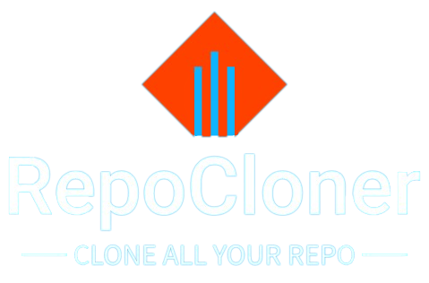

     

<h1 align="center">
     
    Repo Cloner
     
</h1>

&nbsp;

<h3 align="center">Clone all your personal / organisation repository</h3>

&nbsp;

    
    

&nbsp;

&nbsp;
&nbsp;

# ℹ️ About the scripts

You can clone your public personal repository with the [**Clone_personal_repos**](Clone_personal_repos.sh) bash script. 
If you want to do the same with your private repository, just use the script with the *-p* / *--private* option. 
 
You can also clone your organisation repository with the [**Clone_organisation_repos**](Clone_organisation_repos.sh) bash script. 
 
You just need to create a personal GitHub access token and add it to the script. Change the TOKEN variable (in the script code) by your token. 
To change the organisation name, change the ORGANISATION variable (in the script code) by your organisation name.

&nbsp;
&nbsp;

# 🛠️ Technologies

- [**Bash**](https://www.gnu.org/software/bash/manual/bash.html)
